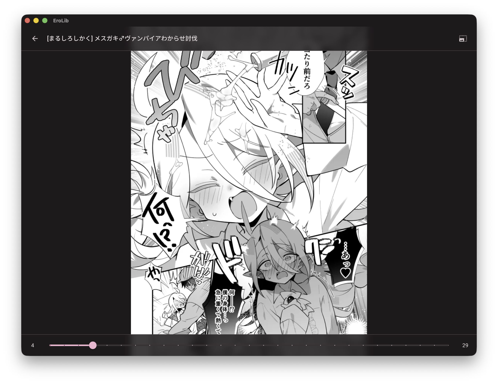
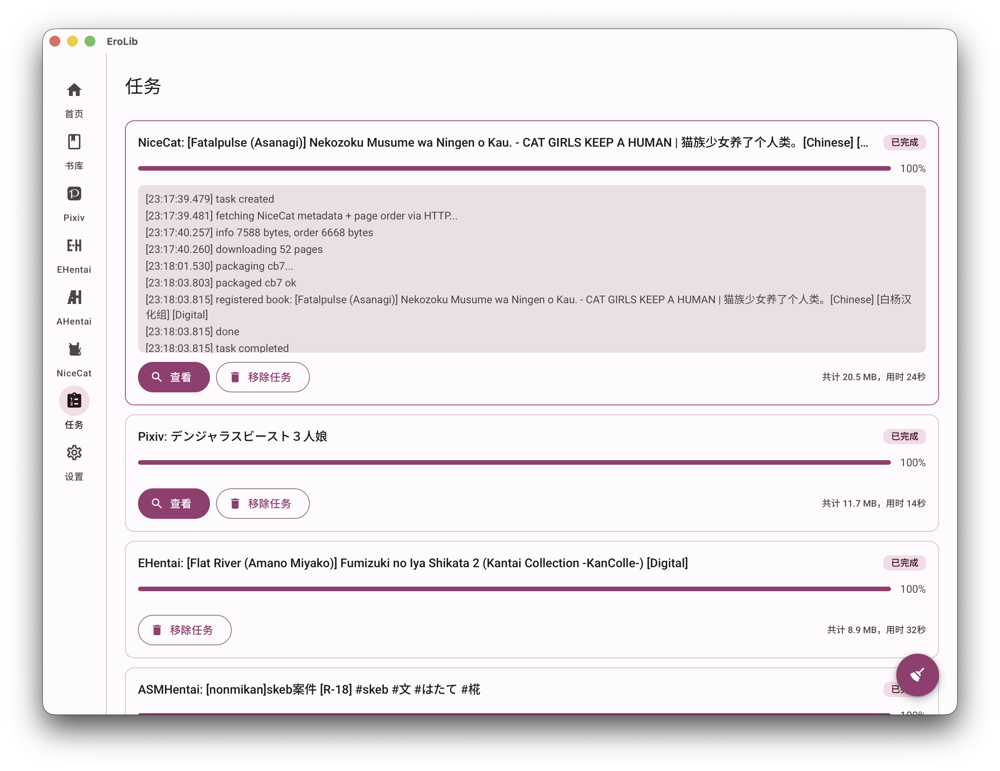

<div align="center">

# 📚 EroLib

### 工口图书馆 · 一站式成人向漫画本地库

**浏览 → 下载 → 阅读 · 全程本地**

Tauri 2 · Vue 3 · Rust · Material Design 3

[](./LICENSE)
[](https://tauri.app)
[](https://vuejs.org)
[](#-下载安装)

</div>

> **EroLib** 是一个桌面端的本地漫画库管理器，内置 **Pixiv**、**EHentai / EXHentai**、**ASMHentai** 与 **NiceCat** 的浏览式下载，开箱即用的 **CB7** 书库与沉浸式阅读器，并通过 **OPDS / RSS** 把书库共享给同一局域网内的任何设备。它把「找图 → 下本 → 看本」收进一个连贯的 Material Design 3 界面里，一切数据都留在你自己的机器上。

<div align="center">

**[✨ 核心特性](#-核心特性)** · **[📥 下载](#-下载安装)** · **[🛠️ 构建](#-自行构建)** · **[❓ FAQ](#-faq)**

</div>

| 首页 | 书库 |
|:---:|:---:|
|  |  |

| 阅读 | 任务 |
|:---:|:---:|
|  |  |

---

## ✨ 核心特性

- 📖 **本地书库**：导入 CB7 / CBZ / CBR / PDF，封面网格浏览，全文搜索 + 标签筛选，阅读列表管理
- 🖼️ **沉浸式阅读器**：全窗口沉浸，键盘 / 点击翻页，动图 (ugoira) 原生支持，进度记忆，自定义主题
- 🎨 **四大下载源**：Pixiv / EHentai / EXHentai / ASMHentai / NiceCat，统一任务管线，断点续传
- 🌐 **OPDS / RSS 共享**：内置 HTTP 服务器，局域网内设备开箱即达，直出单页图 + HTML 图廊
- 🎨 **MD3 动态主题**：4 个内置种子色 + 自定义主题（从书页提取主色），三语界面（中文 / English / 日本語）
- 🔄 **软件自动更新**：启动时静默检查 GitHub releases，下载走 aria2，支持进度显示
- 🏷️ **标签翻译系统**：1014 条种子词条，精确 + 模糊匹配（Levenshtein ≥ 0.8）

> 📚 详细功能说明请参阅 [PRD.md](docs/PRD.md)。

---

## 📥 下载安装

前往 **[GitHub Releases](https://github.com/wpy030414/erolib/releases)** 下载最新版本：

| 平台 | 安装包 |
|---|---|
| **macOS**（Apple Silicon） | `EroLib_*_aarch64.dmg` |
| **Windows** | `EroLib_*_x64-setup.exe` / `.msi` |

- 🐾 **aria2 已内置打包**，无需额外安装任何下载工具。
- macOS 首次打开若提示「无法验证开发者」，前往 **系统设置 → 隐私与安全性 → 仍要打开**。
- Windows 如被 SmartScreen 拦截，选择「仍要运行」。

---

## 🛠️ 自行构建

### 环境要求

- **[Rust](https://rustup.rs)**（stable 工具链）
- **[Node.js](https://nodejs.org)** ≥ 18 与 **[pnpm](https://pnpm.io)**
- macOS：Xcode Command Line Tools（`xcode-select --install`）
- Windows：MSVC 构建工具（Visual Studio Build Tools）

### 步骤

```bash
pnpm install          # 安装前端依赖
pnpm tauri dev        # 开发模式（热重载）
pnpm tauri build      # 构建生产包（.app / .dmg / .exe / .msi）
```

构建产物位于 `src-tauri/target/release/bundle/`。

---

## 🧱 技术栈

**前端**
- [Vue 3.6](https://vuejs.org) `<script setup>` + TypeScript 5 + Vite 8（rolldown + OXC minify）
- [Pinia](https://pinia.vuejs.org) + Vue Router（hash mode）
- [@material/web](https://github.com/material-components/material-web) 2.4.1（Google Material Design 3 Web Components）
- [@material/material-color-utilities](https://github.com/material-foundation/material-color-utilities) HCT 动态主题色生成
- [@mdi/js](https://materialdesignicons.com) 图标 · [idb](https://github.com/jakearchibald/idb) IndexedDB 封装

**后端（Rust）**
- [Tauri 2](https://tauri.app) 桌面框架（插件：http / shell / dialog / fs / clipboard-manager / opener）
- [axum](https://github.com/tokio-rs/axum) 0.7 + tower-http · OPDS / RSS HTTP 服务器
- [sqlx](https://github.com/launchbadge/sqlx) 0.7 + SQLite（WAL / 8 连接池 / `busy_timeout=5000` / `foreign_keys=ON`）
- [aria2](https://aria2.github.io) 下载引擎（内置二进制，JSON-RPC on `localhost:6800`）
- [reqwest](https://github.com/seanmonstar/reqwest) 0.11 · [scraper](https://github.com/causal-agent/scraper) 0.18 · 网络与解析
- [image](https://github.com/image-rs/image) 0.25 · [zip](https://github.com/zip-rs/zip) 0.6 · [quick-xml](https://github.com/tafia/quick-xml) 0.31

---

## 📚 文档

| 文档 | 内容 |
|---|---|
| [AGENTS.md](./AGENTS.md) | 项目边界与 Agent 协作规范 |
| [docs/PRD.md](docs/PRD.md) | 产品需求文档：功能存在的意义 |
| [docs/ARCHITECTURE.md](docs/ARCHITECTURE.md) | 架构地图：稳定的结构关系 |
| [docs/DECISIONS.md](docs/DECISIONS.md) | 设计抉择：历史原因与权衡 |
| [docs/specs/](docs/specs/) | 模块契约：`module-*.md` 格式，可独立实现的任务单元 |

---

## ❓ FAQ

**Q：需要自己安装 aria2 吗？**
不需要。aria2 二进制已随应用打包（macOS / Windows），开箱即用。

**Q：Pixiv / EHentai 怎么登录？**
点击对应页面的「登录」按钮，会打开应用内浏览器；完成登录后 EroLib 会自动采取 cookie 并识别用户，无需手动复制。

**Q：OPDS / RSS 安全吗？**
默认监听全部网卡、无鉴权，方便局域网内设备访问。在公共 / 不可信 Wi-Fi 下，请到「设置 → 共享」手动关闭服务器。

**Q：支持哪些文件格式？**
导入：CB7 / CBZ / CBR / PDF；下载产物：CB7（动图为帧序列 + 延时）。

**Q：数据存在哪里？**
- macOS：`~/Library/Application Support/im.xrl.erolib/`
- Windows：`%LOCALAPPDATA%\im.xrl.erolib\`

---

## 📄 许可证

本项目基于 **[DO WHAT THE FUCK YOU WANT TO PUBLIC LICENSE](./LICENSE)** (WTFPL v2) 开源。

Copyright © 2021-Present **杏仁鹿** `<krkr@xrl.im>`

---

## 👤 作者

**杏仁鹿** — *Do one thing, and do it well.*

- 哔哩哔哩：[@杏仁鹿](https://space.bilibili.com/92465406)
- GitHub：[@wpy030414](https://github.com/wpy030414/erolib)
- 邮箱：`krkr@xrl.im`

<div align="center">

⭐ 如果 EroLib 对你有帮助，欢迎给个 Star！

</div>
